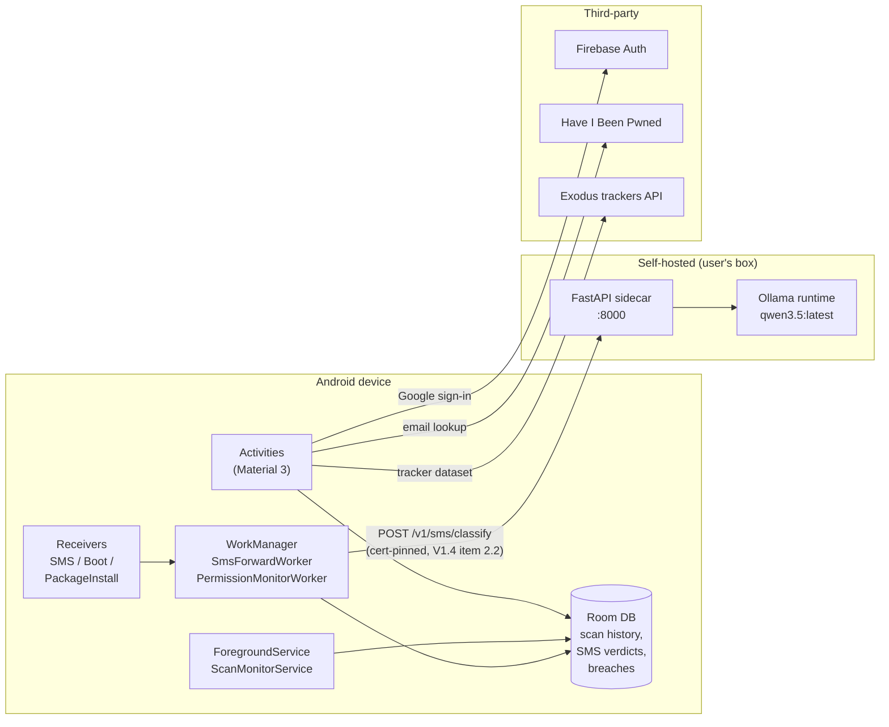
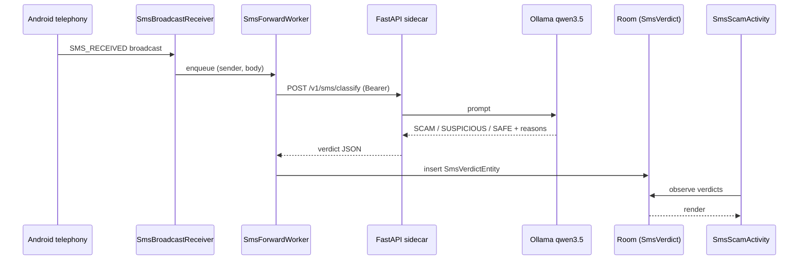

# Architecture

Two deployable artefacts: the **Android app** (`source/`) and the
**AI sidecar** (`scan-ai/`). Everything else (Firebase, HIBP, Exodus,
Ollama) is a third-party service the app or sidecar talks to.

## High-level



## Module layout (Android)

```
com.uow.scan
├── (root)             Activities — every screen in the app
├── adapter            RecyclerView adapters
├── api                Retrofit services (HIBP, Scan-AI)
├── data               Room DB, DAOs, entities
├── model              Plain DTOs / domain types
├── receiver           Broadcast receivers (SMS, Boot, PackageInstall)
├── service            Foreground services
├── ui                 Reusable UI helpers
├── util               Heavy lifting: scanners, analyzers, generators
└── worker             WorkManager workers
```

See [[Activities & Screens]], [[Components - Receivers Services Workers]],
and [[Data Layer - Room]] for per-package detail.

## SMS scam detection — end-to-end



## Wi-Fi security analyser

`util/WifiSecurityAnalyzer.kt` reads the active connection via
`WifiManager` (auth type, cipher, PMF capability, BSSIDs, frequency)
and pairs it with the system DNS list to build a finding set. No
re-association — strictly read-only. See [[Permissions]] for why
`ACCESS_FINE_LOCATION` and `NEARBY_WIFI_DEVICES` are required.

## Breach checker

`util/BreachChecker.kt` orchestrates lookups via
`api/HIBPApiService.kt` (Retrofit). Results are persisted via
`BreachResultDao` so resolution status survives app restarts.

## Persistence boundaries

- **On-device only**: scan results, SMS verdicts, breach state,
  monitored apps, scheduled scans.
- **Off-device**: Firebase Auth tokens (Google), HIBP queries (email
  hash), Exodus tracker dataset (download), sidecar SMS classification
  (sender + body forwarded to **user's own** sidecar).

No telemetry. No third-party analytics SDKs.

See [[AI Sidecar API]] for what the sidecar accepts and returns.
