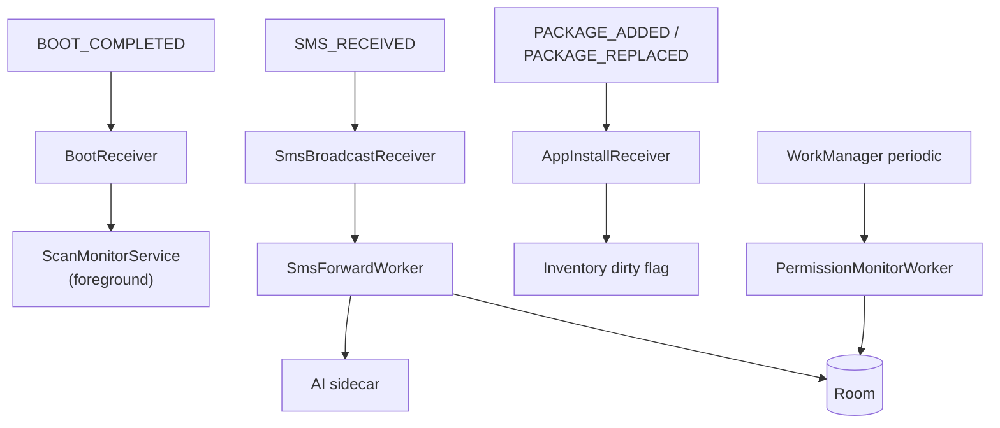

# Components — Receivers, Services, Workers

The non-Activity Android components that keep S'CAN doing useful work
even when no UI is on screen.

## BroadcastReceivers

| Receiver | File | Trigger | What it does |
|---|---|---|---|
| `SmsBroadcastReceiver` | `receiver/SmsBroadcastReceiver.kt` | `android.provider.Telephony.SMS_RECEIVED` (priority 999, requires `BROADCAST_SMS`). | Pulls sender + body from the intent and enqueues `SmsForwardWorker`. Exported (system broadcasts only). |
| `BootReceiver` | `receiver/BootReceiver.kt` | `BOOT_COMPLETED`. | Re-starts `ScanMonitorService` after reboot. Not exported. |
| `AppInstallReceiver` | `receiver/AppInstallReceiver.kt` | `PACKAGE_ADDED`, `PACKAGE_REPLACED` (data scheme `package`). | Marks the app inventory dirty so the next scan picks up the new install/update. Not exported. |

## Foreground services

| Service | File | Type | What it does |
|---|---|---|---|
| `ScanMonitorService` | `service/ScanMonitorService.kt` | `specialUse` | Persistent foreground service for background data-usage monitoring. Manifest declares the special-use subtype: *"Security monitoring — scans background app data usage to protect user privacy."* |
| `TestDataUsageService` | `service/TestDataUsageService.kt` | `dataSync` | Diagnostic service for data-usage capture; used by the test/QA flow. |

> Both services are not exported. `FOREGROUND_SERVICE`,
> `FOREGROUND_SERVICE_SPECIAL_USE`, and `FOREGROUND_SERVICE_DATA_SYNC`
> permissions are declared accordingly — see [[Permissions#Background]].

## WorkManager workers

| Worker | File | What it does |
|---|---|---|
| `SmsForwardWorker` | `worker/SmsForwardWorker.kt` | Posts an SMS to the AI sidecar (`POST /v1/sms/classify`), persists the verdict via `SmsVerdictDao`. Backed off when offline. |
| `PermissionMonitorWorker` | `worker/PermissionMonitorWorker.kt` | Periodic check of granted/denied permissions across monitored apps; raises alerts via `AlertEntity`. |

WorkManager handles retries, network constraints, and battery-aware
scheduling. The runtime is `androidx.work:work-runtime-ktx` 2.9.0 — see
[[Dependencies - Android#Background work]].

## FileProvider

`androidx.core.content.FileProvider` is registered with authority
`${applicationId}.fileprovider` and `file_paths.xml`. Used to share
exported PDF reports out to the user's chosen target via an `Intent.ACTION_SEND`.

## Component graph

See [[Data Layer - Room]] for the entities these components write to.
