# S'CAN — How It All Fits Together

A plain-language map of the app, built for a presentation. Almost everything happens **on your
phone**; when something has to leave, it's a tiny, careful, privacy-safe question — never your
private data. The diagrams below are the skeletons your designer can redraw as polished visuals.

> **Accuracy note (2026-06-02):** every domain, server, dataset and protocol named here was checked
> against the shipping code. Two facts people often get wrong: the IP-owner naming uses the
> **public-domain iptoasn dataset (not MaxMind)**, and our backend lives at **scan-ai.xyz** with a
> **Let's Encrypt** certificate (the product site is **scan.app**). There is no "scan.xyz".

---

## For the designer — how to use this file

- **Every `##` heading is one slide.** The Mermaid block under it is the box-and-arrow skeleton; the
  text is the script.
- **Suggested colour language** (keep it consistent across slides):
  - 🟦 **Blue / calm** = *passive* (we only look — nothing about you leaves).
  - 🟩 **Lime / green** = *active* (we gently ask one safe question, or run the on-device tunnel).
  - ⬜ **Grey** = *the outside world* (other companies' services).
  - 🟪 **Purple** = *our own backend* (the server we run on `scan-ai.xyz`).
- **One golden rule to put on a slide:** *the phone does the thinking; the cloud only does the
  things a phone physically can't.*

> Tip: Mermaid renders these as real diagrams in most tools (and on GitHub). You can paste a block
> straight into the HTML deck, or trace over it with your own shapes.

---

## 1. The big picture

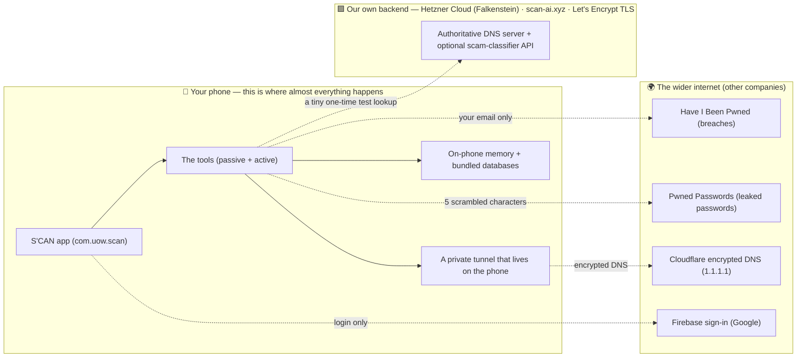

**In plain words:** S'CAN is a security toolbox. The phone runs the checks itself. A few checks need
to ask the outside world a single careful question (e.g. "has this email been leaked?"), and some
use a small server we run ourselves. Nothing about your browsing, your contacts, or your files is
uploaded.

---

## 2. The connection map — every entity, server and domain *(the full, accurate picture)*

This is the slide to get right: who talks to whom, over what, and exactly what crosses each line.

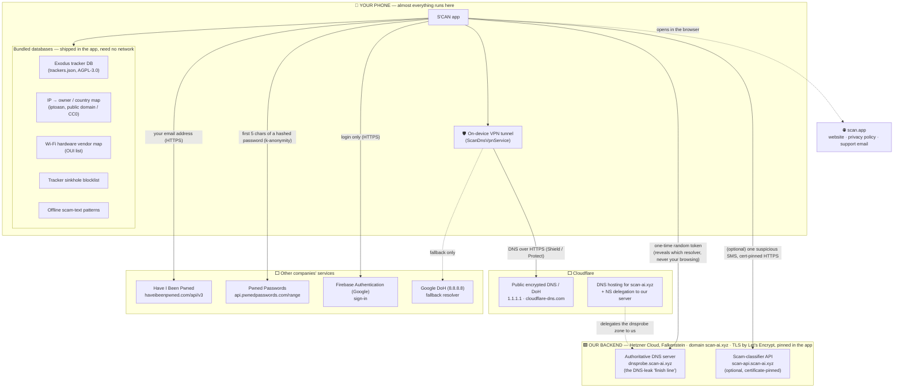

### Domains, servers & certificates (reference table)

| Endpoint / domain | Who runs it | Role | TLS / certificate | What leaves the phone |
|---|---|---|---|---|
| `scan.app` | **Us** | Product site, privacy policy, support email | Web HTTPS | Nothing (informational links) |
| `dnsprobe.scan-ai.xyz` | **Us** — Hetzner Cloud (Falkenstein), authoritative name server | DNS-leak "finish line" | n/a (DNS protocol) | A one-time random token (no private data) |
| `scan-api.scan-ai.xyz` | **Us** — scam-classifier API | Optional smarter scam verdict | **Let's Encrypt, pinned in-app** | (Optional) one SMS body; otherwise handled offline |
| `scan-ai.xyz` (DNS zone) | **Cloudflare** (DNS hosting) | Hosts our DNS, delegates `dnsprobe.*` to our server | n/a | n/a |
| `cloudflare-dns.com` / `1.1.1.1` | Cloudflare | Public encrypted DNS (DoH) for the Shield/Protect tunnel | HTTPS | Your DNS lookups, encrypted (we never see them) |
| `8.8.8.8` (Google) | Google | DoH **fallback** resolver only | HTTPS | Same, only if Cloudflare is unreachable |
| `haveibeenpwned.com/api/v3` | Have I Been Pwned | Email breach lookup | HTTPS | Your email address |
| `api.pwnedpasswords.com/range` | Have I Been Pwned | Leaked-password check | HTTPS | First 5 characters of a SHA-1 hash (k-anonymity) |
| Firebase Authentication | Google | Account sign-in | HTTPS | Login credentials only |

**In plain words:** we run our **own** backend on **Hetzner Cloud** under **scan-ai.xyz**, fronted by
**Cloudflare** for DNS (and the public 1.1.1.1 resolver our tunnel uses), and secured with a
**Let's Encrypt** certificate that the app **pins** (so a fake certificate can't impersonate us). The
only third parties we *send* anything to are the breach databases and the sign-in service — and even
then it's the smallest possible piece.

---

## 3. Three families of checks: *Passive*, *Active*, *Enforce*

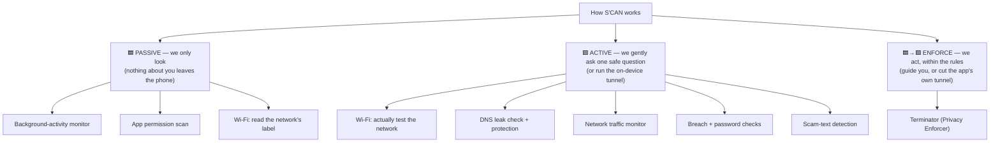

**In plain words:**
- **Passive = looking.** S'CAN reads things your phone already knows — which apps used the camera,
  what permissions an app has, what your Wi-Fi says about itself. None of that leaves the device.
- **Active = asking, carefully.** Some questions can only be answered by *trying* something. S'CAN
  sends a tiny, harmless test and watches what comes back — designed to reveal nothing private.
- **Enforce = acting, within the rules.** Where S'CAN can safely *do* something — guide you to revoke
  a permission, or cut an app's network through its own on-device tunnel — it does. It never reaches
  inside another app (Android forbids that).

---

## 4. What stays on your phone vs. what leaves it

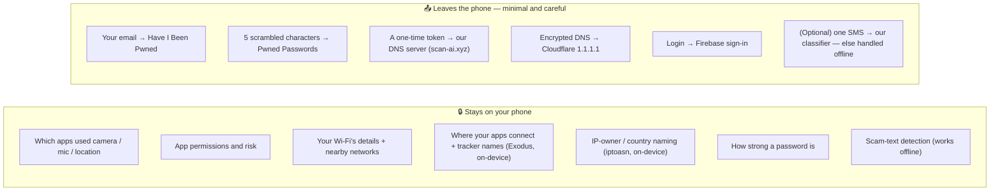

**In plain words:** this is the privacy promise on one slide. The left box never leaves the phone.
The right box is everything that ever crosses the line — and each one is the *smallest possible*
piece (for passwords we don't even send the password, just five characters of a scrambled
fingerprint).

---

## 5. Our own backend — the part that shows we built something real

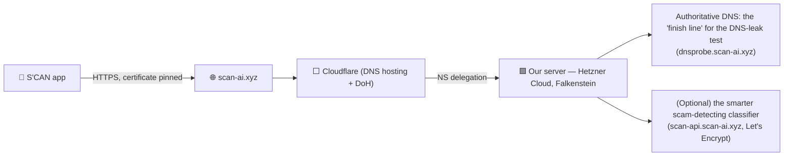

**In plain words:** we don't just call other people's APIs — we run **our own server** on **Hetzner
Cloud** (Falkenstein), under our domain **scan-ai.xyz**, with a real **Let's Encrypt TLS
certificate** that the app **pins** (so nobody can impersonate us). Cloudflare hosts the domain's DNS
and delegates the test sub-zone down to our server. It does two jobs:

1. **The DNS-leak "finish line."** To prove whether your web lookups are private, S'CAN asks the
   network to find a one-time address that only *our* authoritative server can answer for. When that
   lookup arrives, our server can see *which resolver* delivered it and *roughly from where* — which
   tells us if your DNS is private, shared, or being redirected. (It only ever sees the test lookup,
   never your real browsing.)
2. **An optional smarter scam classifier.** Tricky scam texts can be sent — over a certificate-pinned
   connection — to the classifier on our server for a sharper verdict. If the server is ever
   unreachable, the phone quietly does it itself.

**Why this is impressive (for the judges):** owning the domain, the certificate and the server
end-to-end is real infrastructure engineering — most student projects can only consume other
people's APIs.

---

## 6. The one tunnel that does several jobs

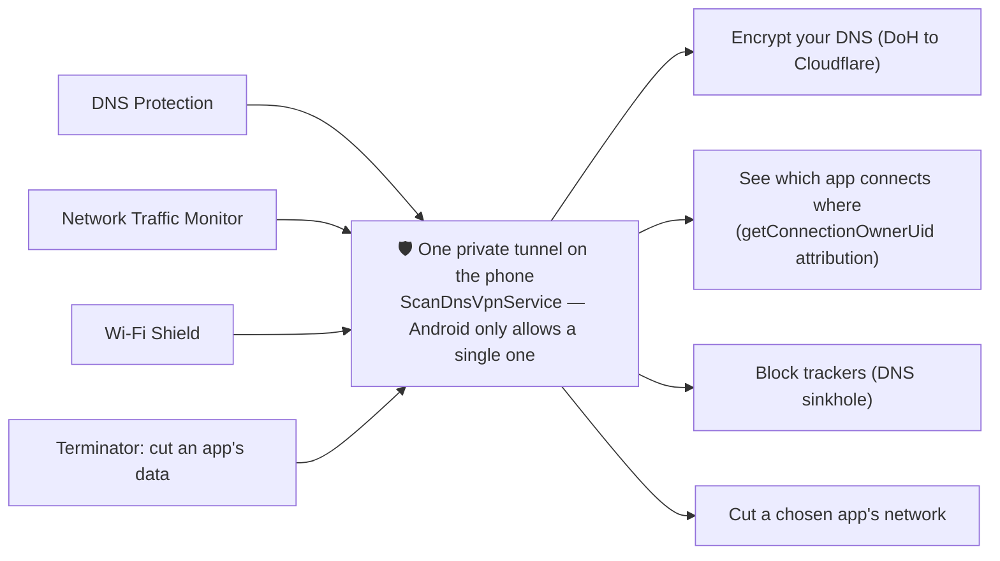

**In plain words:** Android lets an app run only **one** private tunnel at a time. So instead of
fighting over it, S'CAN built **a single smart tunnel** (`ScanDnsVpnService`) that several features
share — it can encrypt your lookups, see which app is talking to whom, block trackers, and cut a
chosen app's data, all at once or any combination. It runs entirely on the phone; your traffic is
**not** routed to us.

**Why it's clever:** elegant reuse of a scarce system resource — one well-built engine instead of
four half-built ones.

---

# The tools — one slide each

> Order suggestion for the deck: lead with the two **passive** tools (the "what's my phone doing
> behind my back" hook), then **Terminator** (the "and here's what we do about it"), then the
> **active** tools (the "and here's how we fight back" payoff).

## 7. 🟦 Passive — Background-Activity Monitor *(the heart of the app)*

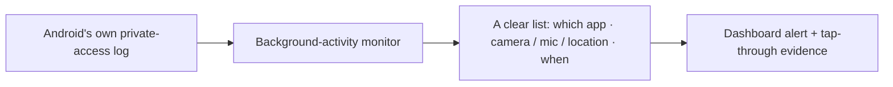

**Answers:** *"Which apps are using my camera, microphone or location behind my back?"*

**In plain words:** Android quietly records when apps reach for sensitive sensors. S'CAN reads that
official record and turns it into a plain list — *this app used your microphone in the background at
2:14pm.* It's all evidence the phone already trusts; nothing is sent anywhere.

**Clever bit:** it uses the operating system's own signed access records, so the evidence is
trustworthy — not a guess.

---

## 8. 🟦 Passive — App Permission Scan

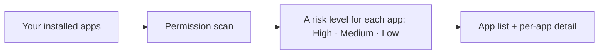

**Answers:** *"What is each app allowed to do — and which ones are over-reaching?"*

**In plain words:** S'CAN reads what every installed app is *allowed* to access and sorts them into
High / Medium / Low risk, so a flashlight app asking for your contacts stands out instantly.

**Clever bit:** the risk level comes from the apps' *real* permissions, read straight from the phone.

---

## 9. 🟦→🟩 Detect & Enforce — Terminator *(the "Privacy Enforcer")*

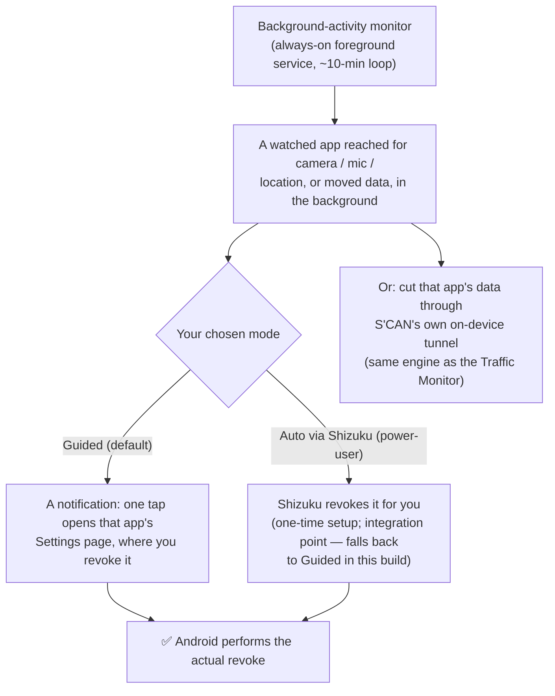

**Answers:** *"An app keeps reaching in behind my back — can I shut that down?"*

**In plain words:** Terminator watches your **watchlist** of apps. When one of them grabs the camera,
mic or location (or moves data) in the background, Terminator acts in the way you chose:
- **Guided (default):** it pops a notification and, with one tap, drops you on **that app's exact
  Settings page** to revoke the permission. **Android** performs the revoke — S'CAN just walks you
  there.
- **Auto via Shizuku (power-user):** for people who complete a one-time wireless-debugging setup,
  Terminator can revoke automatically. *(This is a built-in integration point; in the current build
  it falls back to the Guided notification.)*
- **Cut data:** independently, Terminator can cut a chosen app's network through **S'CAN's own
  on-device tunnel** — the same NetGuard-style engine the Traffic Monitor uses.

**The honest compliance line (put this on the slide):** *Terminator never kills, force-stops, or
silently disables another app — Android forbids that, and S'CAN doesn't pretend otherwise. It can
only (1) detect the abuse and walk you to the switch (or auto-revoke via Shizuku if you set it up),
and (2) cut the app's network through its own tunnel. Verified against Google Play's VpnService
policy and the NetGuard local-firewall model.*

---

## 10. 🟩 Active — Wi-Fi Security *(tested, not just labelled)*

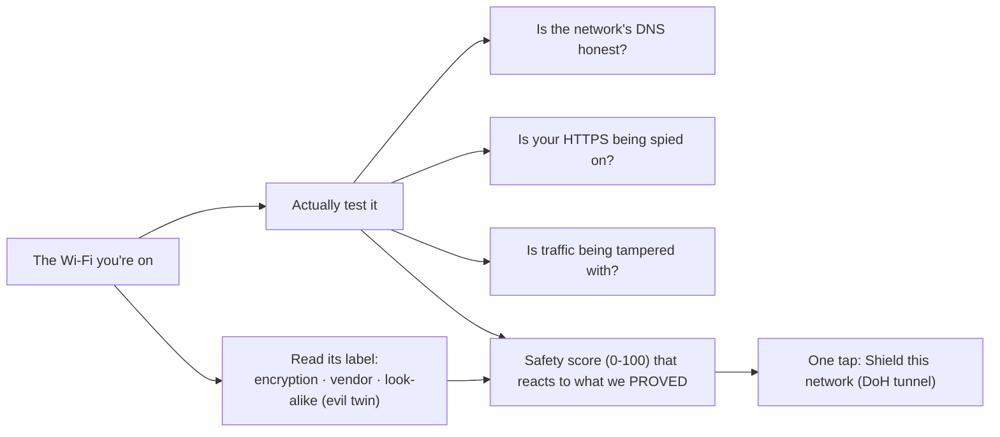

**Answers:** *"Is this Wi-Fi actually safe — or just claiming to be?"*

**In plain words:** most apps only read the label ("this network says it's encrypted"). S'CAN goes
further and **tests** the network: whether it secretly redirects your web lookups, whether someone is
peeking inside your "encrypted" traffic, and whether the connection is being tampered with. The
safety score reflects what we actually *proved*, and passing the live tests plus turning on the
Shield can *raise* it. If it's risky, one tap turns on the Shield.

**Clever bit:** the HTTPS-spying test works because Android won't trust a "fake" certificate an
eavesdropper installs — so if someone's listening, the test catches them red-handed.

---

## 11. 🟩 Active — DNS Leak Detection & Protection

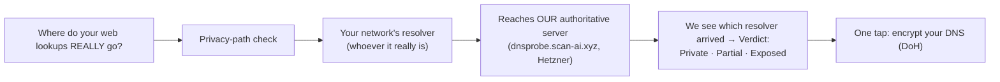

**Answers:** *"Can my network see, or redirect, the sites I visit?"*

**In plain words:** every website visit starts with a "lookup" (turning a name into an address).
S'CAN mints a **one-time** name that only **our authoritative server** can answer, asks your network
to resolve it, and then sees **which resolver** actually showed up at our server — proving whether
your lookups are private, shared with the network, or redirected. If they're exposed, one tap
encrypts them through the tunnel.

**Clever bit:** this is a real **two-tier DNS** trick — your network's resolver unknowingly hands the
query to **our** server, so we learn the truth about your DNS path while only ever seeing a random
test token, never your browsing.

---

## 12. 🟩 Active — Network Traffic Monitor

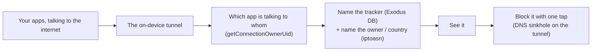

**Answers:** *"Where are my apps actually sending data — and who's tracking me?"*

**In plain words:** S'CAN watches (through its own on-device tunnel) which app connects to which
company, names the known **trackers** from the bundled **Exodus** database, names the **owner and
country** of a destination from the bundled **iptoasn** map, and lets you **block** trackers with a
tap. Tap a tracker to learn *what it collects and why it's there*.

**Clever bit:** attribution uses Android's own `getConnectionOwnerUid`, naming is from a respected
**open** tracker database and a **public-domain** IP map (no MaxMind licence needed), and blocking is
a clean DNS sinkhole that doesn't slow the phone down.

---

## 13. 🟩 Active — Breach Checker

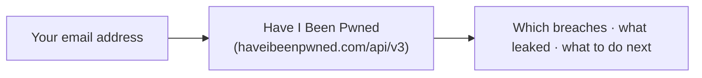

**Answers:** *"Has my email been caught up in a known data breach?"*

**In plain words:** S'CAN checks your email against **Have I Been Pwned**, the world's biggest
catalogue of known breaches, and explains in plain language what was exposed and what to do about it.

**Clever bit:** results are explained as *actions*, not just a scary list.

---

## 14. 🟩 Active — Password Check *(privacy magic trick)*

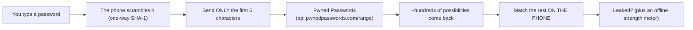

**Answers:** *"Has this exact password leaked — checked privately?"*

**In plain words:** you can check any password without it ever leaving your phone. The phone turns it
into a scrambled fingerprint and sends only the **first five characters** of that fingerprint. The
service sends back the matching block of possibilities, and your phone finds the match itself — so
the service never learns which password you were checking. A separate, fully-offline meter rates how
strong it is.

**Clever bit:** this is a real cryptographic privacy technique (**k-anonymity**) — proving a password
leaked **without ever revealing it**, and it needs **no API key**. Great "wow" moment for a live demo.

---

## 15. 🟩 Active — SMS Scam Detection

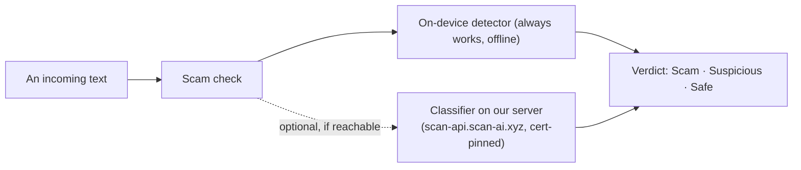

**Answers:** *"Is this text a scam?"*

**In plain words:** S'CAN reads incoming texts and flags scams (fake parcels, toll fees, bank
warnings…). It always has an **on-device** detector that works with no internet, and can optionally
consult the **classifier on our server** (over a certificate-pinned connection) for tricky cases —
falling back gracefully to the on-device detector if the server isn't reachable.

**Clever bit:** it never *needs* the cloud — the phone can always give a verdict, so the feature is
reliable even offline or during a live demo.

---

## 16. What the app remembers (in plain terms)

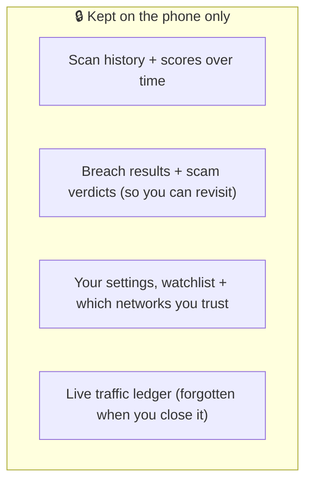

**In plain words:** S'CAN keeps a little history so it can show trends and let you revisit results —
all stored **on the phone**. The live traffic view is deliberately kept *only in memory*, so it
disappears when you're done.

---

## 17. Moving through the app (the screen map)

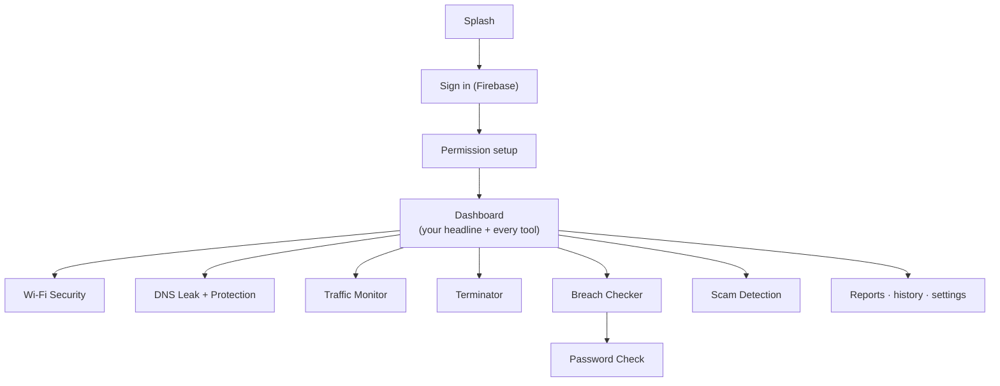

**In plain words:** you sign in, grant permissions once, and land on a **dashboard** that gives you a
single headline ("100 things to look at") and a card for every tool. Everything is one tap away.

---

## 18. Why this is genuinely impressive (the technical-excellence slide)

Keep it plain, but these are the points that win an engineering award:

- **The phone does the hard thinking.** Real on-device analysis (background-access evidence, traffic
  monitoring, password strength, scam detection) — not just screens calling someone else's API.
- **We run real infrastructure.** Our own server on **Hetzner Cloud (Falkenstein)**, our own
  **scan-ai.xyz** domain fronted by **Cloudflare**, with a proper **Let's Encrypt** certificate that
  the app **pins** — end-to-end, not borrowed.
- **One elegant tunnel, several jobs.** A single private tunnel powers DNS protection, traffic
  monitoring, the Wi-Fi Shield and Terminator's data-cut — a clean solution to a real Android
  constraint.
- **We test, we don't assume.** Wi-Fi safety is *proven* with live probes; the score reacts to what
  we actually caught.
- **We respect the rules.** Terminator enforces privacy *within* the Android sandbox — guiding revokes
  and cutting an app's own tunnel — never pretending to reach inside other apps.
- **Privacy by design.** The password check proves a leak **without sending the password**; tracker
  and IP-owner naming run **on-device** from open / public-domain data; scam detection works offline;
  nearly everything stays on the device.
- **It degrades gracefully.** If the cloud is down, the phone still answers — nothing in the demo can
  "go blank."

---

*One sentence to end the deck on: **"S'CAN watches what your phone does behind your back — and where
it can't be sure, it tests, proves it, and fixes it — keeping your data on your phone the whole
time."***
